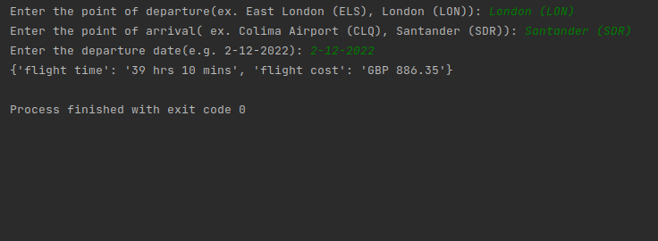
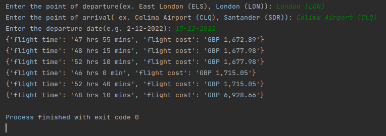

# web_scraping_flights_tickets

This Service searches flight ticket from input place of departure, place of arrival and departure date.


Python must be already installed

```shell
git clone https://github.com/Igor-Cegelnyk/web_scraping_flights_tickets.git
cd web-scraping-flights-tickets/
python3 -m venv venv
source venv/bin/activate (on macOS/Linux) #source venv/Scripts/activate (on Windows)
pip install -r requirements.txt
```

## Features

* Get flight time and flight cost in three click
* Easy to use


## Demo

